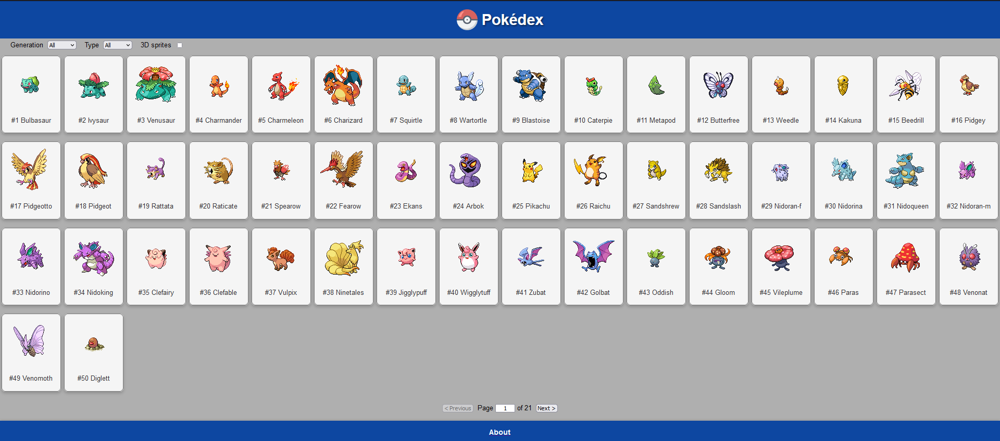
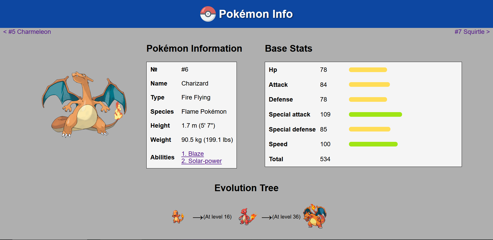

# Pokédex App

Contains all Pokémon from Gen I to Gen IX. Filter Pokémon based on their Gen or Type.
Click on the Pokémon card to see more details about each pokemon




## Run Locally

Clone the project

```bash
  git clone https://github.com/SpiceBureau/b2match
```

Go to the project directory

```bash
  cd b3match
```

Install dependencies

```bash
  npm install
```

Start the server

```bash
  npm start
```
